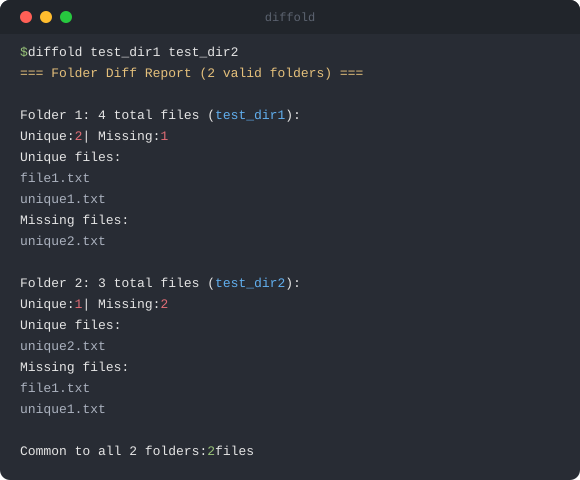

<div align="center">

# diffold

Compare 2–5 directories and see which files are unique, missing, and common across them.

[](https://www.npmjs.com/package/diffold)
[](https://www.npmjs.com/package/diffold)
[](./LICENSE)
[](https://nodejs.org/)
[](https://github.com/drizzer/diffold/actions/workflows/ci.yml)



</div>

`diffold` is a small runtime-agnostic TypeScript CLI. The published package ships compiled JavaScript for package runners, so end users can run it directly with `npx` or `bunx`.

## Quick Start

```bash
# Run without installing
npx diffold dir1 dir2
bunx diffold dir1 dir2

# Or install globally with npm
npm install -g diffold
diffold dir1 dir2 dir3
```

## Usage

```bash
diffold <dir1> <dir2> [... <dirN>]
```

- Requires 2 to 5 directory paths. Every requested folder must validate; if
  any folder cannot be used, diffold reports each bad argument and exits 1.
- Compares file presence by relative path only; it does not compare file contents.
- Skips symbolic links, and ignores entries that resolve outside a compared folder.
- Traversal streams directory entries and counts every visited entry against
  `DIFFOLD_MAX_FILES` (default 500,000), with recursion capped by
  `DIFFOLD_MAX_DEPTH` (default 256). Directories also consume traversal budget,
  so empty-directory trees cannot bypass the file-count limit. Raise the caps
  with `DIFFOLD_MAX_DEPTH` / `DIFFOLD_MAX_FILES` when a real tree legitimately
  exceeds them.
- Empty or whitespace-only directory arguments are rejected before traversal.
  Other names are used exactly as supplied; unsupported `~user/...` spellings
  are not expanded into the current home directory.
- Subdirectories that cannot be read are reported as `[skip] ...` on stderr,
  marked per folder in the report, followed by a `WARNING: Comparison
  incomplete` message; the CLI then exits 1 so scripts do not treat a partial
  report as success.
- File names, printed paths, and error messages are stripped of ANSI/control sequences,
  so a crafted name cannot rewrite your terminal.
- On Windows, quote backslash paths (`"F:\dir\sub"`) or use forward slashes (`F:/dir/sub`) —
  bash-style shells (Git Bash, MSYS2) strip unquoted backslashes before diffold ever sees them.
- If `bunx diffold` fails with `Cannot find module ...\diffold\dist\index.js`,
  that is a bunx auto-install quirk on Windows (observed with Bun 1.4.0):
  it resolves the binary path but never links the package into the global
  `node_modules`. Run `bun install -g diffold` once (then `bunx diffold`
  works), or use `npx diffold@latest` instead.

## Features

- Multi-directory comparison for 2–5 directories
- Color-coded terminal output
- Unique, missing, and common file counts
- Recursive directory traversal
- `~` home-directory expansion
- Windows drive and slash normalization
- Guarded traversal (depth and file-count limits)
- Terminal-safe output (ANSI/control-sequence sanitization)
- Runtime source compatibility with Node.js and Bun. Deno source execution is
  best-effort and remains non-blocking in CI.

## Local Development

Bun 1.4+ is the package manager (see `packageManager` in `package.json`):

```bash
bun install
bun test                 # Bun test runner
bun run test             # node:test via tsx
bun run typecheck
bun run build
node dist/index.js tests/test-folders/test_dir1 tests/test-folders/test_dir2
```

Runtime-specific source execution:

```bash
bun index.ts dir1 dir2
deno run --allow-read --allow-env --allow-sys index.ts dir1 dir2
npx tsx index.ts dir1 dir2
```

Installing straight from Git also works — the `prepare` script builds `dist/` during install.

## Requirements

- Published package / `npx`: Node.js 22+
- Published package / `bunx`: Bun 1.4+
- Source execution: Bun 1.4+ or Node.js 22+ with `tsx`; Deno source execution is best-effort
- Development: Bun 1.4+ (the declared `packageManager`)
