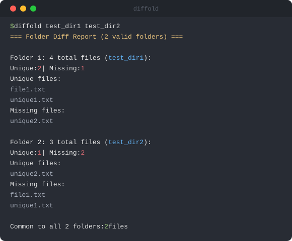

<div align="center">

# diffold

Compare 2–5 directories and see which files are unique, missing, and common across them.

[](https://www.npmjs.com/package/diffold)
[](https://www.npmjs.com/package/diffold)
[](https://www.npmjs.com/package/diffold)
[](./LICENSE)
[](https://nodejs.org/)
[](https://deno.com/)
[](https://github.com/drizzer/diffold/actions/workflows/ci.yml)
[](./package.json)



[](https://github.com/sponsors/drizzer)

</div>

`diffold` is a small runtime-agnostic TypeScript CLI. The published package ships compiled JavaScript for package runners, so end users can run it directly with `npx` or `bunx`.

## Quick Start

```bash
# Run without installing
npx diffold dir1 dir2
bunx diffold dir1 dir2

# Or install globally with npm
npm install -g diffold
diffold dir1 dir2 dir3
```

## Features

- Multi-directory comparison for 2–5 directories
- Content-aware comparison with streaming SHA-256 hashing (disable with `-c`)
- Versioned JSON output for CI, scripts, and piping to tools such as `jq`
- Repeatable glob exclusions for files, directory names, and subtrees
- Summary-first output that stays readable on large trees, with `--verbose` and `--quiet`
- Color-coded terminal output
- Unique, missing, and common file counts
- Recursive directory traversal
- `~` home-directory expansion
- Windows drive and slash normalization
- Guarded traversal (depth and file-count limits)
- Terminal-safe output (ANSI/control-sequence sanitization)
- Runtime source compatibility with Node.js and Bun. Deno source execution is
  best-effort and remains non-blocking in CI.

## Usage

```bash
diffold <dir1> <dir2> [... <dirN>] [options]
```

Options:

| Option | Effect |
|--------|--------|
| `-c`, `--no-content` | Compare paths only. Content comparison is enabled by default. |
| `--json` | Print a machine-readable JSON report to stdout. |
| `-e`, `--exclude <glob>` | Exclude matching files/directories; repeat for multiple patterns. |
| `-v`, `--verbose` | Print every entry instead of truncating long lists. |
| `-q`, `--quiet` | Print only summary counts, no file lists. |

## Excluding Files

Excludes matching files and directory subtrees with repeatable glob patterns:

```bash
diffold dir1 dir2 --exclude '*.log' --exclude 'node_modules' --exclude 'build/**'
```

Patterns support `*` (within one path segment), `?` (one non-separator character),
and `**` (any depth). A pattern without `/` matches a name at any depth; a pattern
containing `/` is matched against the normalized relative path. Excluded directories
are pruned before traversal.

## JSON Output

`--json` prints one JSON document to stdout. Redirect it to a file or pipe it to another tool; diffold does not choose or create an output path:

```bash
diffold dir1 dir2 --json > report.json
diffold dir1 dir2 --json | jq '.modified'
```

The JSON contract includes `schemaVersion: 1`, folder metadata, `unique`, `missing`,
`common`, `identical`, `modified`, and `incomplete`. Human-readable help text remains
on stderr for usage errors, so successful JSON output is never mixed with diagnostics.

## Output Volume

File lists are capped at **20 entries per section** by default, followed by
`... and N more (use --verbose to show all)`. On a real 684-vs-584-file comparison
this keeps the report at ~118 lines instead of ~592.

```bash
diffold dir1 dir2              # counts + first 20 entries per section
diffold dir1 dir2 --verbose    # every entry (or -v)
diffold dir1 dir2 --quiet      # summary counts only, no file lists (or -q)
```

`--json` is never truncated, regardless of these flags — machine consumers always
receive the complete report.

## Behavior & Limits

- Requires 2 to 5 directory paths. Every requested folder must validate; if
  any folder cannot be used, diffold reports each bad argument and exits 1.
- Compares file presence by relative path and hashes files present in every folder to
  identify identical versus changed content. Use `-c` / `--no-content` to skip hashing.
- Skips symbolic links, and ignores entries that resolve outside a compared folder.
- Excludes matching files and directory subtrees with repeatable glob patterns:

```bash
diffold dir1 dir2 --exclude '*.log' --exclude 'node_modules' --exclude 'build/**'
```

Patterns support `*` (within one path segment), `?` (one non-separator character),
and `**` (any depth). A pattern without `/` matches a name at any depth; a pattern
containing `/` is matched against the normalized relative path. Excluded directories
are pruned before traversal.
- Traversal streams directory entries and counts every visited entry against
  `DIFFOLD_MAX_FILES` (default 500,000), with recursion capped by
  `DIFFOLD_MAX_DEPTH` (default 256). Directories also consume traversal budget,
  so empty-directory trees cannot bypass the file-count limit. Raise the caps
  with `DIFFOLD_MAX_DEPTH` / `DIFFOLD_MAX_FILES` when a real tree legitimately
  exceeds them.
- Empty or whitespace-only directory arguments are rejected before traversal.
  Other names are used exactly as supplied; unsupported `~user/...` spellings
  are not expanded into the current home directory.
- Subdirectories that cannot be read are reported as `[skip] ...` on stderr,
  marked per folder in the report, followed by a `WARNING: Comparison
  incomplete` message; the CLI then exits 1 so scripts do not treat a partial
  report as success.
- File names, printed paths, and error messages are stripped of ANSI/control sequences,
  so a crafted name cannot rewrite your terminal.
- On Windows, quote backslash paths (`"F:\dir\sub"`) or use forward slashes (`F:/dir/sub`) —
  bash-style shells (Git Bash, MSYS2) strip unquoted backslashes before diffold ever sees them.
- If `bunx diffold` fails with `Cannot find module ...\diffold\dist\index.js`,
  that is a bunx auto-install quirk on Windows (observed with Bun 1.4.0):
  it resolves the binary path but never links the package into the global
  `node_modules`. Run `bun install -g diffold` once (then `bunx diffold`
  works), or use `npx diffold@latest` instead.

## Local Development

Bun 1.4+ is the package manager (see `packageManager` in `package.json`):

```bash
bun install
bun test                 # Bun test runner
bun run test             # node:test via tsx
bun run typecheck
bun run build
node dist/index.js tests/test-folders/test_dir1 tests/test-folders/test_dir2
```

Runtime-specific source execution:

```bash
bun index.ts dir1 dir2
deno run --allow-read --allow-env --allow-sys index.ts dir1 dir2
npx tsx index.ts dir1 dir2
```

Installing straight from Git also works — the `prepare` script builds `dist/` during install.

## Requirements

- Published package / `npx`: Node.js 22+
- Published package / `bunx`: Bun 1.4+
- Source execution: Bun 1.4+ or Node.js 22+ with `tsx`; Deno source execution is best-effort
- Development: Bun 1.4+ (the declared `packageManager`)

## Contributing

Contributions are welcome. Please read [CONTRIBUTING.md](./CONTRIBUTING.md) for
the setup, the runtime matrix you need to test against, and the PR checklist.
Participation is governed by the
[Code of Conduct](./CODE_OF_CONDUCT.md).

## Support

If diffold saves you some time, you can support continued maintenance:

- [GitHub Sponsors](https://github.com/sponsors/drizzer)
- [Ko-fi](https://ko-fi.com/drizzer)
- [Buy Me a Coffee](https://buymeacoffee.com/drizzer)

Bug reports are most useful when they include the exact arguments, the folder
layout, and what you expected to happen.

## Security

Please report security issues **privately** through
[GitHub Security Advisories](https://github.com/drizzer/diffold/security/advisories/new)
rather than opening a public issue. See [SECURITY.md](./SECURITY.md) for the
current security posture.

## License

[MIT](./LICENSE) © 2026 DRiZZER
